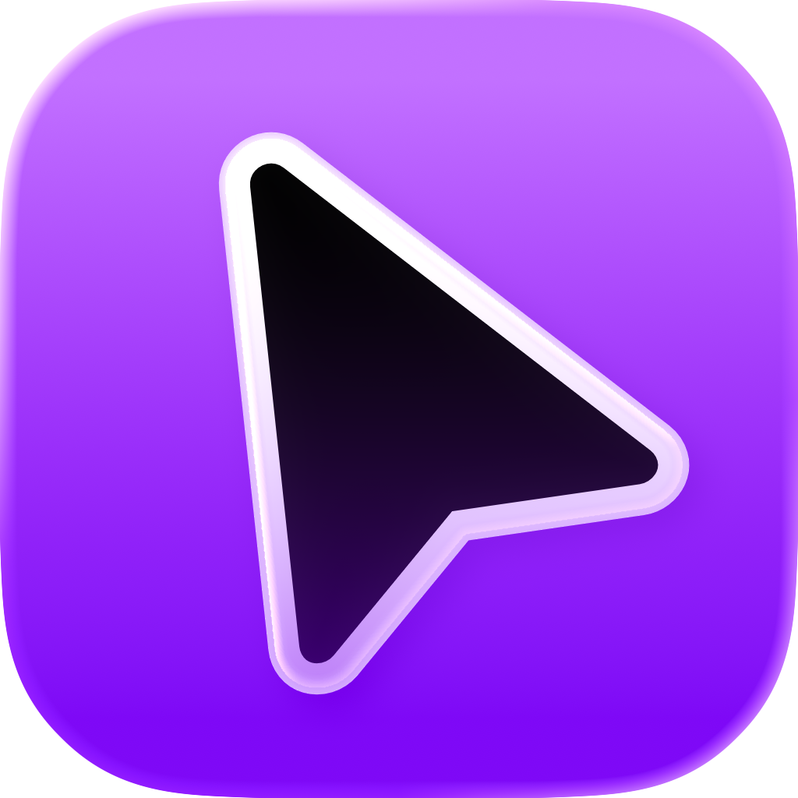

   

  <h1><b>Magnes</b></h1>
  
<i>Make the macOS cursor work like it does on the iPad!</i>

<h6 align="center">

# Magnes

- Magnes is a W.I.P. application designed to emulate the functionality tied to the iPadOS cursor.

# Features
- Makes the cursor snap to nearby elements system-wide using accessibility APIs
- Enables "trackpad inertia", which makes the cursor glide across the screen instead of stopping immediately
- Changes the cursor images to styles that closely resemble the iPadOS variants

# Installation

## Requirements
- macOS 26 (Only supported version at this time, may work on older versions as far back as macOS 13.5)

## Downloads
- Coming soon

# License

Magnes is licensed under a custom non-commercial license. See [`LICENSE`](LICENSE) for details.

# Credits
- CodaFi for [CGSInternal](https://github.com/NUIKit/CGSInternal) (MIT)
- Nick Bolton for the function that hides the default cursor